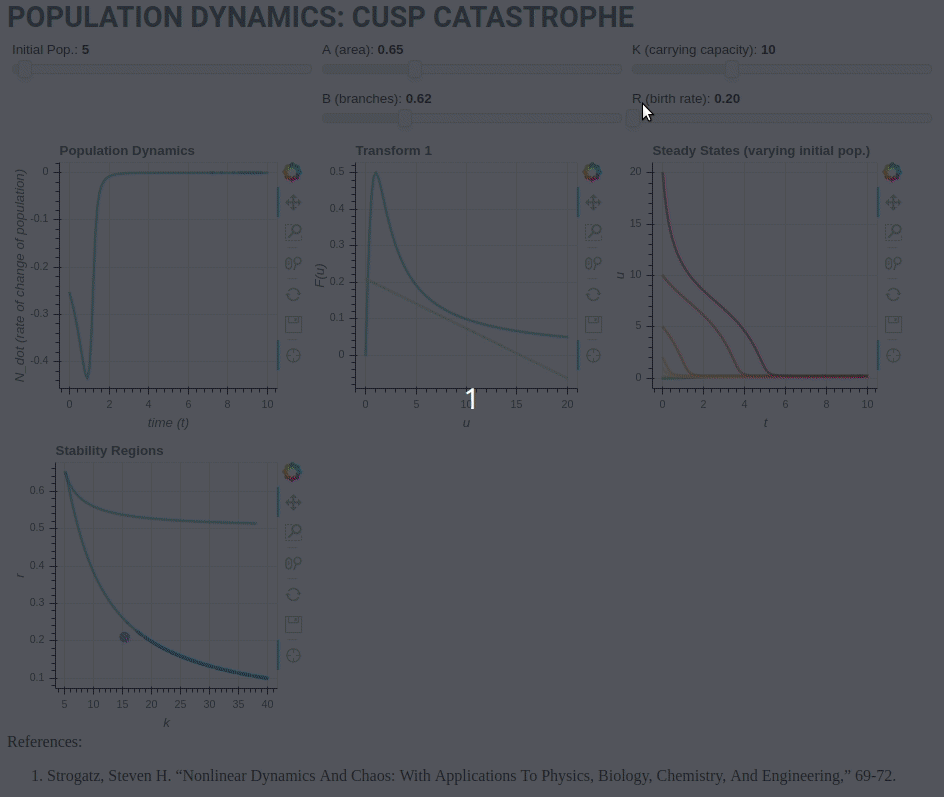

# Cusp Catastrophe

This code uses [Bokeh Server](https://bokeh.pydata.org/en/latest/docs/user_guide/server.html) to run an interactive application demonstrating population dynamics.

## Motivation

This summer I'm making my way through the [lecture videos](https://www.youtube.com/playlist?list=PLbN57C5Zdl6j_qJA-pARJnKsmROzPnO9V) for Nonlinear Dynamics and Chaos taught by Steven Strogatz.  In the textbook, there is a challenge in Section 3.7 to plot the nonlinear system representing an insect outbreak in its parameterized form as a 3d surface.  The system is known as a ['cusp catastrophe'](http://mathworld.wolfram.com/CuspCatastrophe.html), and in a more general sense, I think it represents systems exhibiting hysteresis that have a 'bistable region', which means the system will approach different stable states depending upon the initial state (and maybe also the perturbation?).

The system is represented by the following:

$\dot{N} = RN\left(1-\frac{N}{K} \right) - \frac{BN^2}{A^2 +N^2}$
Where:

* **$N$** is the population size
* **$R$** is growth rate
* **$K$** is the carrying capacity
* **($A,B>0$)** are constants related to thresholds governing predation behaviour (I don't think I've named the sliders correctly in this case.)

## Screenshots

## Tech/framework

Built with
* [Bokeh](https://bokeh.pydata.org)

## Installation

Create new environment
`$>virtualenv -p python3 env`

Activate the environment
`$>source env/bin/activate`

Install requirements
`$>pip install -r requirements.txt`

Run Bokeh server (from project root folder)
`$>bokeh serve .`

Open browser and navigate to `localhost:5006/chaos_nonlinear_dynamics`

## Credits

* *Strogatz, Steven H. “Nonlinear Dynamics And Chaos: With Applications To Physics, Biology, Chemistry, And Engineering,” 69-72.*

## License

[MIT](https://opensource.org/licenses/MIT) © Dan Kovacek